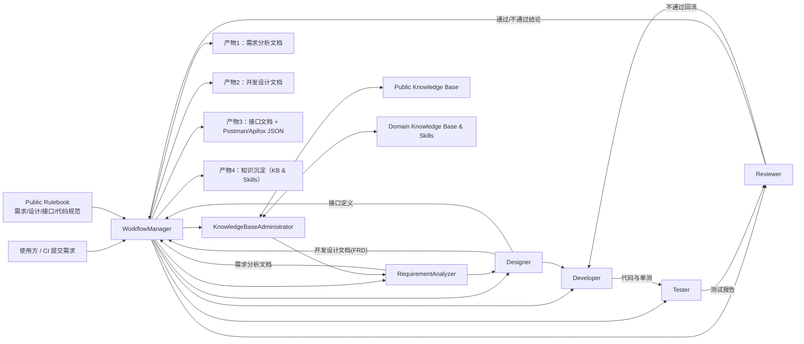
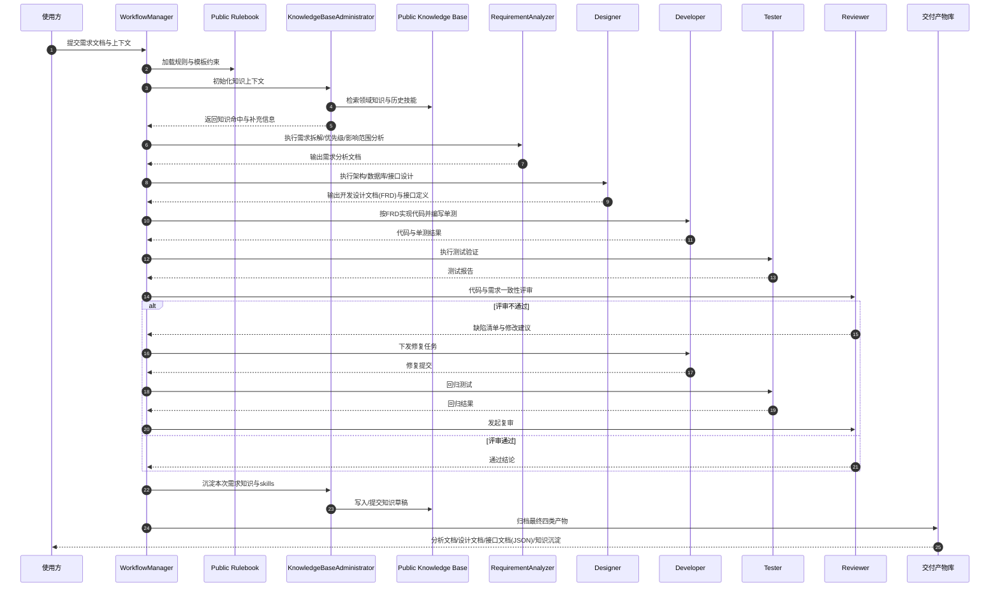

# AI Delivery Engine

`AI Delivery Engine` 是一个面向需求交付的 Python Agent 工程，用于把非结构化需求文档转成标准化交付物，并在生成过程中执行规则约束、知识增强和质量校验。

## 项目定位

系统围绕 7 角色协作流水线工作：

1. `KnowledgeBaseAdministrator`：知识库与领域 skill 沉淀
2. `RequirementAnalyzer`：需求解析、拆解、优先级、影响范围分析
3. `Designer`：架构与数据设计、开发设计文档（FRD）生成
4. `Developer`：编码计划与单测覆盖建议
5. `Tester`：测试计划与测试报告建议
6. `Reviewer`：一致性检查与质量审查
7. `WorkflowManager`：流程编排与产物聚合

## 角色协作架构图



## 角色交互时序图



## 交付产物

执行 `generate` 后输出以下文件：

- `$(需求名)_Analysis_Report.md`：需求分析报告
- `$(需求名)_FRD.md`：开发设计文档（含数据库设计与 ER 图）
- `$(需求名)_Interfaces.md`：接口文档（字段与示例均为表格展示）
- `$(需求名)_Quality_Assessment.md`：质量评估报告
- `$(需求名)_Execution_Trace.json`：执行轨迹（节点耗时/重试摘要/节点级明细）
- `$(需求名)_Interfaces_Postman.json`：Postman 导入文件
- `$(需求名)_Interfaces_Apifox.json`：Apifox/OpenAPI 导入文件

## 关键能力

- 规则库驱动：严格执行使用方定义的公共规则库
- 知识库增强：支持 `local / remote / hybrid` 三种公共知识库模式
- LangGraph 编排：默认使用 `langgraph` 状态图执行 7 角色流程
- 节点级重试：支持节点失败自动重试与线性退避（可配置）
- 文档语义边界控制：每类文档自动做“越界清理 + 结构校验”
- 质量评估与门禁：输出指标评分与 `PASS/WARN/BLOCK` 门禁结论

## 安装

```bash
cd /path/to/ai-delivery-engine
python3 -m pip install -e .
```

## 环境变量（可选）

```bash
export OPENAI_API_KEY="<YOUR_KEY>"
export OPENAI_BASE_URL="<YOUR_BASE_URL>"
export OPENAI_MODEL="gpt-5.4"
```

未配置模型也可运行（`--disable-llm` 规则模式）。
提示：Python `3.14` 下启用 `langgraph` 时可能出现 `langchain_core` 的兼容性告警（`UserWarning`），通常不影响执行。

## 快速使用（CLI）

### 1. 扫描代码上下文

```bash
python3 -m app.cli scan-context \
  --project-root /path/to/project-root \
  --output outputs/context_snapshot.json
```

### 2. 生成文档与接口 JSON

```bash
python3 -m app.cli generate \
  --context-file outputs/context_snapshot.json \
  --requirement-file examples/card-center-refactor.md \
  --out-dir outputs/latest \
  --templates-dir templates \
  --knowledge-dir knowledge_base \
  --rules-dir knowledge_base/public_rules \
  --kb-mode local \
  --kb-dir public_knowledge_base \
  --kb-namespace default \
  --orchestrator langgraph \
  --node-retry-max-attempts 2 \
  --node-retry-backoff-ms 200
```

可选参数：

- `--disable-llm`：关闭 LLM，强制规则模式
- `--strict-llm`：LLM 不可用时直接失败，不回退
- `--orchestrator`：编排器选择，默认 `langgraph`，支持 `classic` 与 `langgraph`
- `--node-retry-max-attempts`：LangGraph 节点重试总尝试次数（含首次执行）
- `--node-retry-backoff-ms`：LangGraph 节点重试退避时长（毫秒，线性退避）
- `--strict-kb`：知识库不可用时直接失败，不降级
- `--enforce-quality-gate`：质量门禁为 `BLOCK` 时命令返回失败
- `--quality-gate-policy-file`：指定自定义门禁策略 JSON

## Execution Trace 说明

`$(需求名)_Execution_Trace.json` 用于追踪本次编排执行细节，核心字段如下：

- `orchestrator`：本次使用的编排器（`langgraph` / `classic`）
- `node_retry_policy.max_attempts`：节点总尝试次数（含首次执行）
- `node_retry_policy.backoff_ms`：节点重试退避基线（毫秒）
- `runtime_stats.stage_durations_ms`：各阶段耗时
- `runtime_stats.node_retry_summary`：按节点聚合的尝试/重试/失败统计
- `runtime_stats.node_trace`：节点级执行明细（包含 attempt、status、duration、error）

## FastAPI 服务化使用

### 1. 启动 API 服务

```bash
ai-delivery-engine-api
```

或：

```bash
uvicorn app.api.main:app --host 0.0.0.0 --port 8000
```

可选鉴权配置（建议生产环境开启）：

```bash
export API_BEARER_TOKEN="replace-with-your-token"
```

或配置多 token：

```bash
export API_BEARER_TOKENS="token-a,token-b"
```

异步任务执行配置（可选）：

```bash
export API_TASK_WORKERS="2"
export API_TASK_STORE_FILE="outputs/api_tasks/tasks.json"
```

说明：异步任务状态会持久化到 `API_TASK_STORE_FILE`，服务重启后可继续查询历史任务状态。

启动后可访问：

- Swagger UI: `http://127.0.0.1:8000/docs`
- ReDoc: `http://127.0.0.1:8000/redoc`

### 2. 核心接口

- `GET /health`：健康检查
- `POST /scan-context`：扫描项目上下文并生成快照
- `POST /generate`：执行完整交付流程并产出文档/接口 JSON
- `POST /generate-async`：异步提交生成任务
- `GET /tasks`：任务列表（支持 `?status=` 过滤）
- `GET /tasks/{task_id}`：查询异步任务状态与结果
- `POST /tasks/{task_id}/cancel`：取消任务（协作式取消）
- `POST /kb-review`：更新公共知识草稿审批状态

### 3. 调用示例

```bash
curl -X POST "http://127.0.0.1:8000/scan-context" \
  -H "Content-Type: application/json" \
  -d '{
    "project_root": "/path/to/project-root",
    "output": "outputs/context_snapshot.json"
  }'
```

```bash
curl -X POST "http://127.0.0.1:8000/generate" \
  -H "Content-Type: application/json" \
  -d '{
    "requirement_file": "examples/card-center-refactor.md",
    "context_file": "outputs/context_snapshot.json",
    "out_dir": "outputs/latest",
    "templates_dir": "templates",
    "knowledge_dir": "knowledge_base",
    "rules_dir": "knowledge_base/public_rules",
    "kb_mode": "local",
    "kb_dir": "public_knowledge_base",
    "kb_namespace": "default",
    "orchestrator": "langgraph",
    "node_retry_max_attempts": 2,
    "node_retry_backoff_ms": 200
  }'
```

异步调用示例：

```bash
curl -X POST "http://127.0.0.1:8000/generate-async" \
  -H "Content-Type: application/json" \
  -d '{
    "requirement_file": "examples/card-center-refactor.md",
    "project_root": "/path/to/project-root",
    "out_dir": "outputs/latest",
    "orchestrator": "langgraph",
    "node_retry_max_attempts": 2,
    "node_retry_backoff_ms": 200
  }'
```

```bash
curl "http://127.0.0.1:8000/tasks/task_xxxxxxxxxxxx"
```

```bash
curl "http://127.0.0.1:8000/tasks?status=RUNNING&limit=20"
```

```bash
curl -X POST "http://127.0.0.1:8000/tasks/task_xxxxxxxxxxxx/cancel"
```

## 模板文件

当前使用的模板：

- `templates/Requirement Analysis Report Template.md`
- `templates/Funditional Requirement Document.md`
- `templates/api_doc.md.j2`

## 目录结构

```text
ai-delivery-engine/
  app/
    api/
    agents/
    ingest/
    kb/
    llm/
    render/
    exporters/
    rules/
    schemas/
    validators/
    workflow/
    services/
    cli.py
  templates/
    Requirement Analysis Report Template.md
    Funditional Requirement Document.md
    api_doc.md.j2
  knowledge_base/
    public_rules/
    skills/
  public_knowledge_base/
  docs/
    PROJECT_INTRO.md
    PROJECT_GUIDE.md
    USAGE.md
    PUBLIC_KB_API.md
  examples/
```

## 文档

- 项目介绍：`docs/PROJECT_INTRO.md`
- 详细手册：`docs/PROJECT_GUIDE.md`
- 使用说明：`docs/USAGE.md`
- 公共知识库 API 契约：`docs/PUBLIC_KB_API.md`
