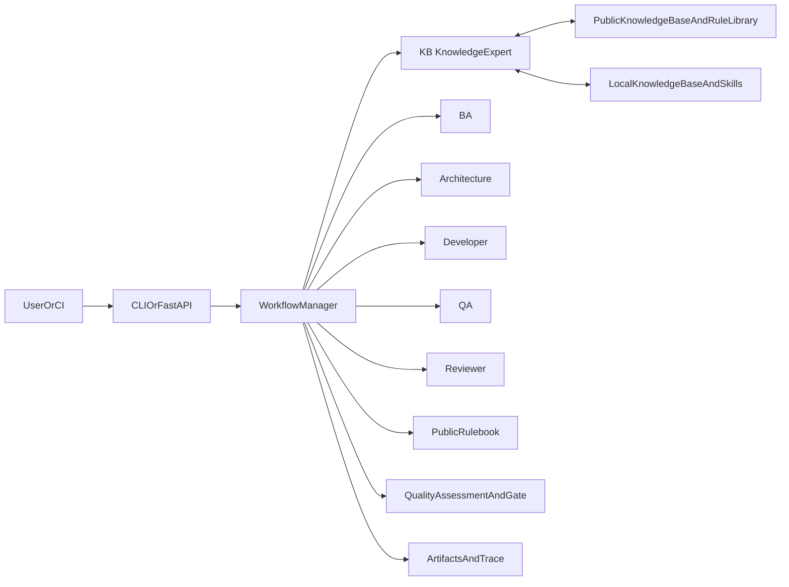
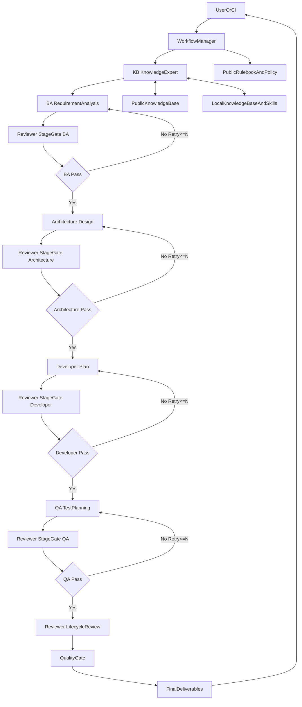
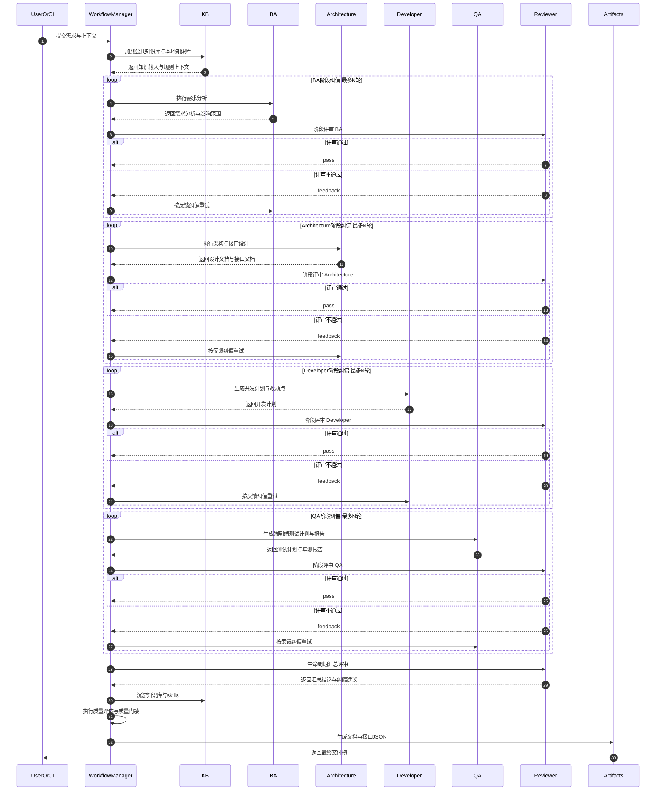

# AI Delivery Engine

`AI Delivery Engine` 是一个面向需求交付场景的 Python Agent 引擎。  
它将“需求文档 + 代码上下文 + 知识库 + 规则库”转化为可直接使用的交付产物，并输出可追踪的质量评估与执行轨迹。

核心定位：
- 让非标需求文档也能进入标准交付流程。
- 通过 5 个核心角色 + 2 个平台能力完成端到端编排。
- 产出结构化文档、接口 JSON、质量报告和执行追踪。

## 核心能力

| 能力 | 当前实现 |
| --- | --- |
| 需求分析报告生成 | 已实现（按模板渲染 + 语义边界校验） |
| 开发设计文档（FRD）生成 | 已实现（含架构图、时序图、数据设计与 ER 图） |
| 接口文档生成 | 已实现（Markdown + Postman + Apifox/OpenAPI） |
| 质量评估与门禁 | 已实现（量化评分 + PASS/WARN/BLOCK） |
| 公共知识库接入 | 已实现（`local` / `remote` / `hybrid`） |
| FastAPI 服务化 | 已实现（同步 + 异步任务 + 可选鉴权） |
| 直接修改目标业务仓代码 | 未实现（当前输出“开发计划”，不直接提交业务代码） |
| 自动执行 pytest 并回填真实覆盖率 | 未实现（当前生成测试计划与单元测试报告草案） |

## 架构总览



## 各角色协作流程图



## 角色协作时序图



阶段评审纠偏说明：
- `BA`、`Architecture`、`Developer`、`QA` 各阶段完成后都会立即触发 Reviewer 阶段评审。
- 评审不通过时会在同阶段内执行纠偏重试，重试次数与退避由 `node_retry_max_attempts` / `node_retry_backoff_ms` 控制。
- `Lifecycle summary review` 是汇总评审节点，用于生成全流程一致性结论与门禁输入。

## 角色定义（最新版）

| 角色 | 关键职责 |
| --- | --- |
| `KB` | 严格把控知识库输入与更新，前置统一规则库约束，持续沉淀 skills。 |
| `BA` | 严格按需求文档与业务背景分析需求，按模板产出需求分析报告输入。 |
| `Architecture` | 基于 BA 输出与架构基线完成业务/应用/技术/数据架构设计。 |
| `Developer` | 从代码视角制定开发计划，明确具体改动点与影响范围。 |
| `QA` | 设计 end-to-end 单元测试用例，覆盖目标 >=95%。 |
| `Reviewer` | Teach Lead 角色，按生命周期分阶段评审并及时纠偏，直到产物可直接落地开发。 |

## 快速开始

### 1) 安装

```bash
cd <AI_DELIVERY_ENGINE_ROOT>
python3 -m pip install -e .
```

### 2) 配置 LLM（推荐）

```bash
export OPENAI_API_KEY="<YOUR_API_KEY>"
export OPENAI_BASE_URL="<YOUR_BASE_URL>"
export OPENAI_MODEL="gpt-5.4"
```

说明：
- 如果不配置 `OPENAI_API_KEY`，可用 `--disable-llm` 走规则回退模式（`generate` 命令支持）。
- 默认模型回退链路：`--model` > `OPENAI_MODEL` > `gpt-5`。

### 3) 极简模式（固定 6 参数）

```bash
python3 -m app.cli generate-simple \
  --public-kb-dir <PUBLIC_KB_DIR> \
  --local-kb-dir <LOCAL_KB_DIR> \
  --requirement-file <REQUIREMENT_FILE> \
  --project-root <PROJECT_ROOT> \
  --out-dir <OUTPUT_DIR> \
  --model gpt-5.4
```

`generate-simple` 内置固定行为（来自代码实现）：
- `kb_mode=local`
- `orchestrator=langgraph`
- `node_retry_max_attempts=2`
- `node_retry_backoff_ms=200`
- `strict_kb=False`
- `strict_llm=False`
- `enforce_quality_gate=False`

规则目录优先级：
- 优先读取 `<LOCAL_KB_DIR>/public_rules`
- 若不存在则自动回退到引擎内置 `knowledge_base/public_rules`

## CLI 命令

### 扫描上下文

```bash
python3 -m app.cli scan-context \
  --project-root <PROJECT_ROOT> \
  --output outputs/context_snapshot.json
```

### 完整生成

```bash
python3 -m app.cli generate \
  --requirement-file <REQUIREMENT_FILE> \
  --project-root <PROJECT_ROOT> \
  --out-dir <OUTPUT_DIR> \
  --templates-dir templates \
  --knowledge-dir knowledge_base \
  --rules-dir knowledge_base/public_rules \
  --kb-mode local \
  --kb-dir public_knowledge_base \
  --orchestrator langgraph
```

### 公共知识草稿审批

```bash
python3 -m app.cli kb-review \
  --draft-id <DRAFT_ID> \
  --approval-status APPROVED \
  --reviewer <REVIEWER> \
  --note <NOTE> \
  --kb-mode local \
  --kb-dir <PUBLIC_KB_DIR>
```

## 产物清单与命名

需求文件名为 `payment_upgrade.md` 时，输出如下：

| 文件名 | 说明 |
| --- | --- |
| `payment_upgrade_Analysis_Report.md` | 需求分析报告 |
| `payment_upgrade_FRD.md` | 开发设计文档 |
| `payment_upgrade_Interfaces.md` | 接口文档 |
| `payment_upgrade_Quality_Assessment.md` | 质量评估报告 |
| `payment_upgrade_Interfaces_Postman.json` | Postman 导入文件 |
| `payment_upgrade_Interfaces_Apifox.json` | Apifox/OpenAPI 导入文件 |
| `payment_upgrade_Execution_Trace.json` | 执行追踪（节点重试与时延） |

知识累计目录（`knowledge_dir`）会更新：
- `Domain_Knowledge_Base.json`
- `Domain_Skills_Catalog.md`
- `Domain_Knowledge_and_Skills.md`
- `skills/*.md`

## FastAPI 服务化

### 启动

```bash
ai-delivery-engine-api
```

或

```bash
uvicorn app.api.main:app --host 0.0.0.0 --port 8000
```

### 可选环境变量

```bash
export API_BEARER_TOKEN="<TOKEN>"
export API_BEARER_TOKENS="<TOKEN_A>,<TOKEN_B>"
export API_TASK_WORKERS="2"
export API_TASK_STORE_FILE="outputs/api_tasks/tasks.json"
export API_HOST="0.0.0.0"
export API_PORT="8000"
```

鉴权规则：
- 未配置 `API_BEARER_TOKEN(S)`：除 `/health` 外接口默认不鉴权。
- 配置后：除 `/health` 外接口都要求 Bearer Token。

### 核心接口

| Method | Path | 说明 |
| --- | --- | --- |
| `GET` | `/health` | 健康检查 |
| `POST` | `/scan-context` | 扫描代码上下文 |
| `POST` | `/generate` | 同步生成 |
| `POST` | `/generate-async` | 异步提交生成任务 |
| `GET` | `/tasks` | 查询任务列表（支持 `status`、`limit`） |
| `GET` | `/tasks/{task_id}` | 查询任务详情 |
| `POST` | `/tasks/{task_id}/cancel` | 取消任务 |
| `POST` | `/kb-review` | 公共知识草稿审批 |

## 公共知识库与规则库

### 公共知识库模式

- `local`：从本地目录读取快照。
- `remote`：通过 HTTP 请求远程知识服务。
- `hybrid`：远程拉取并本地缓存。

`local` 模式可识别快照文件：
- `public_knowledge_snapshot.json`
- `knowledge_snapshot.json`
- `knowledge.json`
- `MANIFEST.json`

### 公共规则库（执行规范）

`rules_dir` 需包含：
- `Requirement_Analysis_Report_Standard.md`
- `Technical_Design_Document_Standard.md`
- `Interface_Document_Standard.md`
- `Code_Development_Standard.md`

可选：
- `Quality_Gate_Policy.json`

说明：
- 规则库是执行约束，不会作为产物输出。
- 若规则文件缺失，流程会在加载阶段直接报错。

## 质量机制

质量机制分两层：
- 第三阶段：`quality_report`（量化指标、风险信号、建议动作）。
- 第四阶段：`quality_gate`（`PASS/WARN/BLOCK` + 评分 + 阻断原因）。

支持生命周期分阶段策略：
- `ba`
- `architecture`
- `developer`
- `qa`

可在 `Quality_Gate_Policy.json` 对单阶段设置：
- `block_if_failed`
- `warn_if_failed`
- `block_error_count_gt`
- `warn_warning_count_gt`

## 退出码约定

`generate` / `generate-simple` 主要退出码：
- `0`：执行成功（含门禁非阻断场景）。
- `1`：校验不通过或启用 `--enforce-quality-gate` 且门禁为 `BLOCK`。
- `2`：运行时错误（如模板缺失、规则缺失、编排器不可用）。

## 深入文档

- 完整项目指南：`PROJECT_GUID.md`
- 详细技术手册：`docs/PROJECT_GUIDE.md`
- 公共知识 API 协议：`docs/PUBLIC_KB_API.md`
- 典型使用样例：`docs/USAGE.md`
